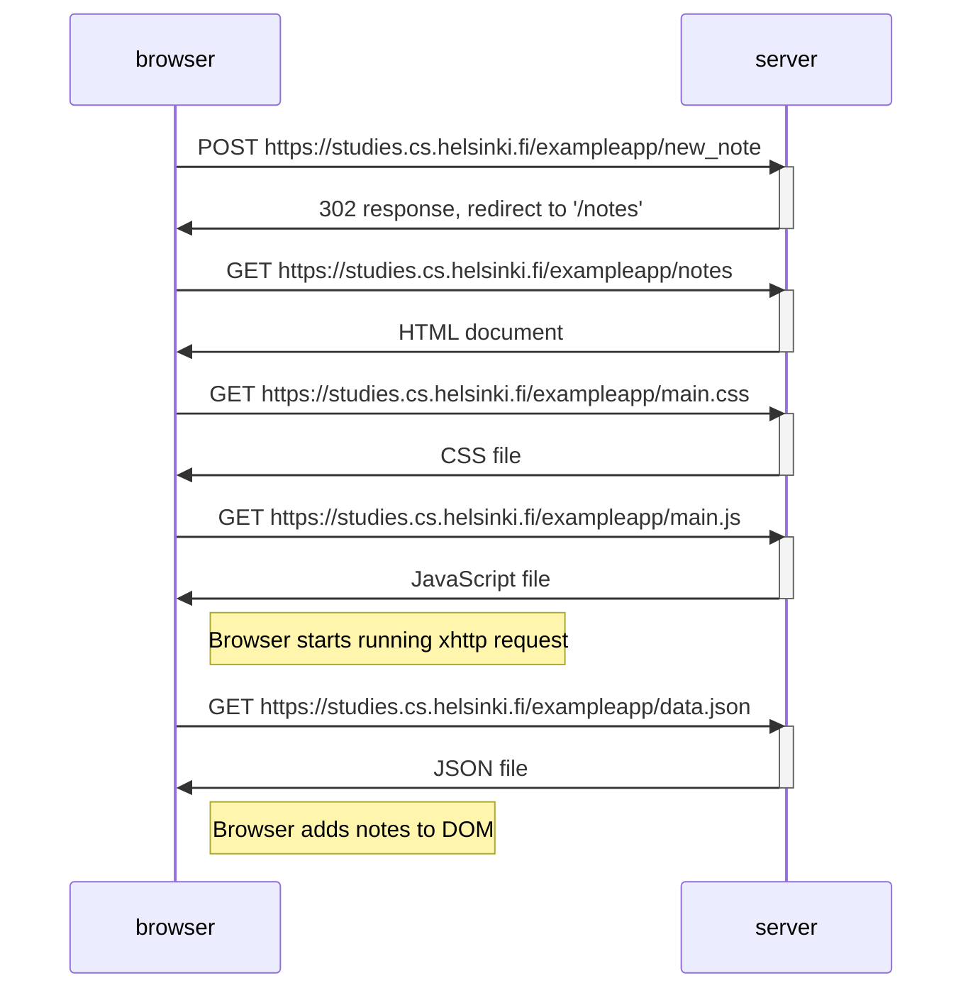

```mermaid
sequenceDiagram

  participant browser
  participant server

  browser ->> server: POST https://studies.cs.helsinki.fi/exampleapp/new_note
  activate server
  server ->> browser: 302 response, redirect to '/notes'
  deactivate server

  browser ->> server: GET https://studies.cs.helsinki.fi/exampleapp/notes
  activate server
  server ->> browser: HTML document
  deactivate server

  browser ->> server: GET https://studies.cs.helsinki.fi/exampleapp/main.css
  activate server
  server ->> browser: CSS file
  deactivate server

  browser ->> server: GET https://studies.cs.helsinki.fi/exampleapp/main.js
  activate server
  server ->> browser: JavaScript file
  deactivate server
  note right of browser: Browser starts running xhttp request

  browser ->> server: GET https://studies.cs.helsinki.fi/exampleapp/data.json
  activate server
  server ->> browser: JSON file
  deactivate server
  note right of browser: Browser adds notes to DOM


```