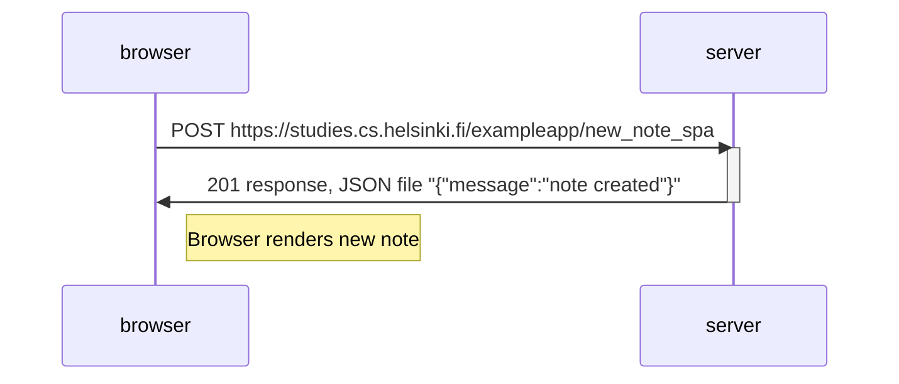

```mermaid
sequenceDiagram

  participant browser
  participant server

  browser ->> server: POST https://studies.cs.helsinki.fi/exampleapp/new_note_spa
  activate server
  server ->> browser: 201 response, JSON file "{"message":"note created"}"
  deactivate server
  note right of browser: Browser renders new note
```